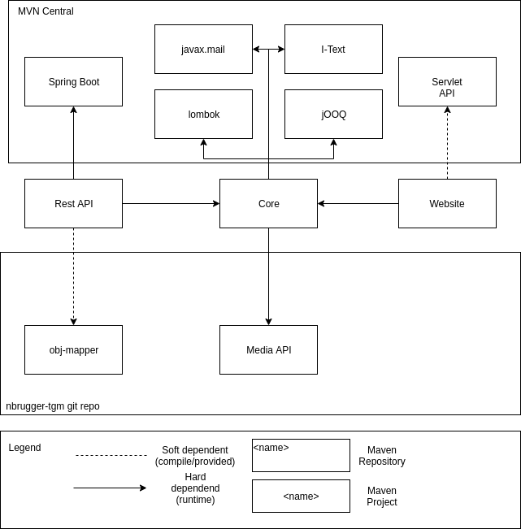

# Local Admin

## Table of content

- Conclusion
- What is it
- Commands
- Technology
  - core
  - Rest API
  - Webpage
- Data Structure
  - humane
  - Database
    - Model
    - Procedures
- Architecture
  - Basics
  - Core
  - Webpage
  - Rest API
- Extendability
  - Basics
  - Client/Frontend
  - API
  - Core/Backend
  - Database

## Conclusion

> The reason conclusion is the first point is that this is very important

### MySQL

- Stored procedure params allways with a prefix which does not occur in any table (like `p_my_param_name` instead of `my_param_name`)
- Time zone needs to be the same as the one from the accessing host
- Don't use it

### OAS

+ Dont use `oneOf`! It will mess up all your codegen and nobody likes it
+ Everything is a model! Do never declare something(response body etc.) as more than a ref. It will mess up all your codegen
+ Also define 'native' (`int`,`string`,`boorlen`,etc) as models when they have restrictions (min/max/enum)
+ Use `allOf`! Sometimes you will forget how usefull it is; use it (it does not mee up your code but it will not lead to intherence [`extends`])
+ Decide between overengeneering (like we did) or only providing things the user needs and also in a way they need it

## What is it

The function and usage area is described in over 100 Pages so we won't repeat it all

> This 100 page document is called `Lastenheft` and `Machbarkeitsstudie` (which are owned by every owner of the software)

## Commands

> All commands are only testet with debian & Ubuntu. And some of them are using `apt`

| Command                                 | Description                                                  |
| --------------------------------------- | ------------------------------------------------------------ |
| ./scripts/start.sh                      | Recompiles the projects and starts the updated docker container |
| ./scripts/create-installer.sh {version} | Creates an DEB installer with the version tag given, (automaticly builds/compiles project) |
| ./scripts/export.sh                     | Compiles all sub projects and copies the result to the `export` folder |
| ./scripts/init.sh                       | Downloads all sub git repos (only execute at the very start) |
| ./scripts/install-tools.sh              | Downloads/Installs all tools you need for this project like autogenerators |
| ./scripts/update.sh                     | Updates/Pulls all dependencies                               |

## Technology

### General


| Usage      | Technology     |
| ---------- | -------------- |
| Database   | MySQL 8.0      |
| Deployment | Docker Compose |

### Core

| Usage                | Technology |
| :------------------- | ---------- |
| Programming Language | Java 8     |
| Build Tool           | Maven      |
| ORM/Sql Framework    | JOOQ       |

### API

| Usage                | Technologie |
| -------------------- | ----------- |
| Type                 | REST Api    |
| Framework            | Spring Boot |
| Programming Language | Java 8      |
| Build Tool           | Maven       |

### Webpage
| Usage                | Technologie |
| -------------------- | ----------- |
| Type                 | Server Sided   |
| Framework            | Tomcat/JSP |
| Programming Language | Java 8      |
| Build Tool           | Maven       |

## Data Structure

### Humane

> Written in the perspective of the customer who bought the software

I like to store all my `restaurants`, they have: `name`, an informal `location`, a unique `number` and a `status` - displaying if the restaurant is opened or not. Each restaurant also has employees which are responsible for this restaurant. A employee could also work for more restaurants. A employee should be a person which is in the system. So i like to have a user system where each user has a name and an email-address. Each user only has certain permissions. These are defined by his permission Group (eg. Manager, Restaurant Manager). Each of this group should have multiple permissions. The list of all permissions is down there. A restaurant also has a dashboard where all issues the restaurant has are posted. Such a issue has a text around 2000 chars max. It also should have a title, priority from 1-5 and also a flag if it is already done. We also need a list storing email addresses, new issues should be mailed to. These mail addresses do not need to be users in the system. For each restaurant there exist multiple daily reports (one per day max),
each of this reports contains a pair list of daily-columns and their value (in cent) at this date. Talking of columns. There exist 3 Types of columns. The thing they all have in common is a name and a description where the name is identifying. The 3 column types are daily-columns, formulas and salary-levels. a formula is composed of 2 columns(every type) as well as a mathematical operator which should apply to them. It also should be possible to attach additional columns to a formula, like a chain (c1+c2+c3+c4 -> c3+c4 are *other* columns). Where salary levels store changes for each restaurant. This changes are bound to a specific date and there can only be one per restaurant and day. The change stores a value in cent. I would also like to store filters which contain the names of the columns they will show. The last thing is that i would like to store my email settings which consist of 2 filters a subject and a text

### Diagram

> Some tables are documented using comments


### Procedures

All calculations happen in the DB for performance reasons.

| Procedure                                                    | Description                                                  |
| ------------------------------------------------------------ | ------------------------------------------------------------ |
| `calculate(column varchar(200),restaurant int,date date,out var long)` | Calculates the value of `column` at `date` for a specific `restaurant`. The result is stored in the out param `var` |
| ``calculate_multi_restaurant(column varchar(200),restaurant varchar(256),in date date,out result long)`` | Works simmilar to `calculate`. The difference is the treatment of `restaurant`. The parameter should be in the form : `<id1>,<id2>,<id3>` (without brackets).<br />It does calculates the value of the column same as `calculate` but it calculates multiple restaurants. |
| `sum_table(restaurant int,from date,to date)`                | Returns a table containing value pairs with summs of the values between `from` and `to` and for a specific `restaurant` |
| `sum_table_multi_restaurant(restaurants varchar(256),from date,to date)` | Same as `sumTable` with the difference that it calculates the sums across restaurants<br />The `restaurants` parameter should be in the form : `<id1>,<id2>,<id3>` (without brackets). |
| `sum_up(column varchar(200),from date, to date,restaurant int, out value long)` | Calculates the sum of a `column` between a timespan between `from` and `to` for a specific `restaurant` and stores it into `value` |
| `sum_up_multi_restaurant(column varchar(200),from date,to date,restaurant varchar(255), out v long)` | same as `sum_up` but accross multiple restaurants.<br />The `restaurants` parameter should be in the form : `<id1>,<id2>,<id3>` (without brackets). |

> Functions are nearly the same but they are useable in `select` statements. 
>
> `RESOLVE_FORMULA` is a alias for `calculate`
>
> Functions have their out param as return type

## Architecture

### Basics

The project is divied into 5 parts:

- Core
- Rest-API
- Webpage
- Service Worker
- License server

The `core` is the base of all other components as it is reponsible for logic operatios and mainly DB access. All projects except the `license server`  are dependents of the core.

Here is a dependency graph:



### Core

The core contains all Database operations.

##### Some infos

- The core keeps a thread alive in the background which checks the health of the DB connection and tries to reconnect if the connection is lost.
- We use jOOQ as ORM/SQL Framework
- We don't use caching

#### Packages

|           Package            | Description                                                  |
| :--------------------------: | :----------------------------------------------------------- |
|        `com.finance`         | This is the main Package                                     |
|    `com.finance.manager`     | here are all the `Manager` classes                           |
|      ``com.finance.db``      | autogenerated by jOOQ                                        |
| `com.finance.db.tables.pojo` | Here are the pojos representing the DB.<br />This are the classes we use as model<br />(as return/parameter types) |
|      `com.finance.pdf`       | All PDF generator classes are placed here.<br />And also some PDF Components |
|      `com.finance.util`      | Contains utils and the Database connector                    |
|      `com.finance.lib`       | Contains model class which are not convered <br />by the autogeneration |

### Rest API

#### Packages

|             Package              | Description                                                  |
| :------------------------------: | :----------------------------------------------------------- |
|      `com.niton.localadmin`      | This is the main Package                                     |
|    `com.niton.localadmin.gen`    | All classes in here are autogenerated<br />Nearly untouched  |
| `com.niton.localadmin.gen.wire`  | Classes to convert between the core classes<br />and the RestResponse Classes<br />*not autogenerated* |
| `com.niton.localadmin.gen.model` | Contains classes that will be jsonized and returned<br />*autogenerated* |
|  `com.niton.localadmin.gen.api`  | Contains interfaces describing the Endpoints<br />*autogenerated & modifyed* |
|   `com.niton.localadmin.rest`    | Root package of all implementation classes                   |
| `com.niton.localadmin.rest.api`  | The implemented Endpoints                                    |

#### Endpoint architecture

The endpoint definitions are autogenerated interfaces in  `com.niton.localadmin.gen.api`.  So the endpoints do exist but are not implemented at this point. 

Example of such a interface:

```java
@ApiOperation(
    value = "Add Salary Level Change",
    nickname = "addSalaryChange",
    notes = "Records a salary level Change",
    authorizations = {
        @Authorization(value = "User_Auth")
    },
    tags={ "Payroll", }
)
@ApiResponses(
    value = { 
        @ApiResponse(code = 201, message = "Created"),
        @ApiResponse(
            code = 401,
            message = "Unauthorized",
            response = AutoGenErrorResponse.class
        ),
        @ApiResponse(
            code = 404,
            message = "Not Found",
            response = AutoGenErrorResponse.class
        ),
        @ApiResponse(
            code = 500,
            message = "Internal Server Error",
            response = AutoGenErrorResponse.class
        ) 
    }
)
@RequestMapping(
    value = "/salary-level/{name}/payroll/{restaurant}/changes",
    produces = { "application/json","application/xml" }, 
    consumes = { "application/json","application/xml" },
    method = RequestMethod.POST
)
default ResponseEntity<?> addSalaryChange(
    @Size(min=2,max=200)
    @ApiParam(value = "Name of the salary level",required=true)
    @PathVariable("name") 
    String name,
    
    @ApiParam(value = "The ID of the restaurants",required=true)
    @PathVariable("restaurant")
    Integer restaurant,
    
    @ApiParam(value = "The change to save")
    @Valid
    @RequestBody
    AutoGenSalarychange autoGenSalarychange
) throws Exception {
	return new ResponseEntity<>(HttpStatus.NOT_IMPLEMENTED);
}
```

You see it is a lot of boilerplate code. This is not a mehtod you would like to write code into. Because of this we made it an interface we can extend and implement later on with ease.

Example implementation (of the method above):

```java
@Override
public ResponseEntity<?> addSalaryChange(
    String salaryLevel,
    Integer restaurant,
    AutoGenSalarychange autoGenSalarychange
) throws Exception {
    //implementation and code
    return response(201);
}
```

So you see its a lot more easy to find/write code and not beeing distracted by loads of not informal stuff.

> This works as `@Annotations` which controll Spring are overtaken by overwriting methods

### Webpage

> The webpage was not build to be sustained in a long term -> No detailed information

## Extendibility

All components were designed to be easy to extend as far as it is possible.
Closer explanation about *how* to extend the components are written down on the corresponding repository

There are several layers of extendibility:

* **Clients**
  * Very easy
  * Limited to the usage of the API
  * Every Programming Language
  * Possibilities
    * Creating Websites or Apps
    * Creating desktop Applications
    * Integrate in existing Projects
* **API**
  * Relatively easy
  * Needs to be done in Java
  * Nearly no Algorithmic(Calculations etc.) needed
  * Limited to the functionality in the core
  * Possibilities
    * Create endpoints for new functionalities in the core
    * Make access to certain data more easy
    * Make more data accessible
    * Reinforce HTTPS/Certificate/Security
    * Implement HTTP level restrictions
* **Core**
  * Relatively Complex
  * Design Patterns (architecture) and logic needed
  * Limited to Features of the Database
  * Possibilities:
    *  **Adding complete new features**
      * They would still need to be implemented in the API
      * You can only add features at this level which do not need changes in the database
    * Reinforcing old algorithms/logic
    * Alter existing logic
    * Completely rewrite (nearly) anything
    * Change the PDF generation (style/logic/add new)
    * 90% of bugfixes need to be done here
* **Database**
  * Complex
  * Much algorithmic/logic/architecture (skills) needed
  * Limited to SQL and especially MySQL
  * Possibilities
    * Adding the Base of all new features
    * Adding additional data
    * All types of calculation should be done at this layer  to ensure further extendibility

Adding or changing stuff in a layer does indeed needs all layers above to adapt to this change.
For example: You would like to add the feature close a restaurant for a certain time. As the Database has no table for such a change, you would need the following steps

1. Adding the tables/procedures/views to the database
2. Re-autogenerate the code to the `core`
3. Implement logic and database accesses in `core`
4. Implement endpoints in the `rest-api` to access the new data
5. (optional) Add the interface in the `client`/frontend which enables the user to finally use the feature

